# Module 7

## Key Lessons

This module primarily taught:

 1. ERD rules such as: specifying minimum and maximum cardinalities, specifying primary keys in entities, and unique attributes within entities.
 2. Common ERD rule violations such as: including redundant foreign key attributes inside entities, specifying weak entity types with no identifying relationship, or specifying wrong cardinalities between entities.

## Practice Problems

### Problem 1

Draw an ERD containing the Order and Customer entity types connected by a 1-M relationship from Customer to Order. Choose an appropriate relationship name using your common knowledge of interactions between customers and orders. Define minimum cardinalities so that an order is optional for a customer and a customer is mandatory for an order. For the Customer entity type, add attributes CustNo (primary key), CustFirstName, CustLastName, CustStreet, CustCity, CustState, CustZip, and CustBal (balance). For the Order entity type, add attributes for the OrdNo (primary key), OrdDate, OrdName, OrdStreet, OrdCity, OrdState, and OrdZip. If you are using a data modeling tool that supports data type specification, choose appropriate data types for the attributes based on your common knowledge.

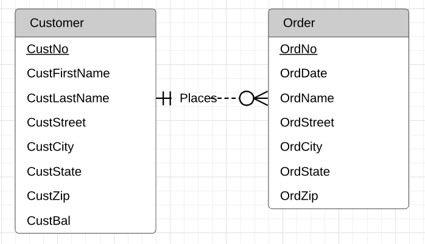

### Problem 2

Extend the ERD from problem 1 with the Employee entity type and a 1-M relationship from Employee to Order. Choose an appropriate relationship name using your common knowledge of interactions between employees and orders. Define minimum cardinalities so that an employee is optional to an order and an order is optional to an employee. For the Employee entity type, add attributes EmpNo (primary key), EmpFirstName, EmpLastName, EmpPhone, EmpEmail, EmpCommRate (commission rate), and EmpDeptName. If you are using a data modeling tool that supports data type specification, choose appropriate data types for the attributes based on your common knowledge.

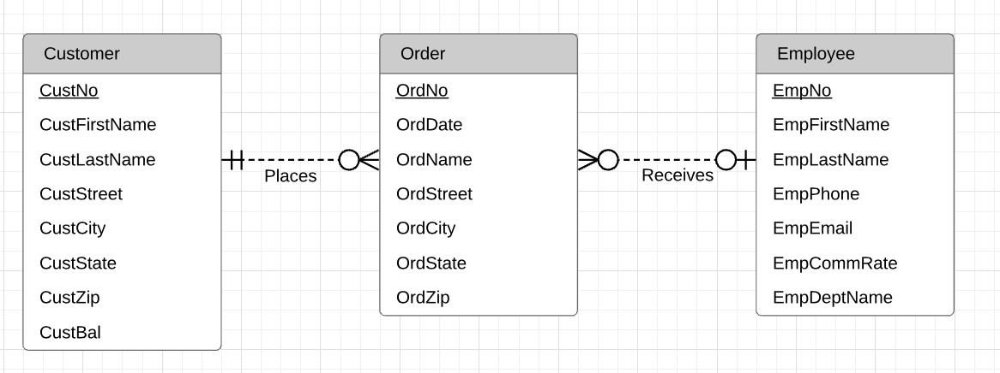

### Problem 3

Extend the ERD from problem 2 with a self-referencing 1-M relationship involving the Employee entity type. Choose an appropriate relationship name using your common knowledge of organizational relationships among employees. Define minimum cardinalities so that the relationship is optional in both directions.

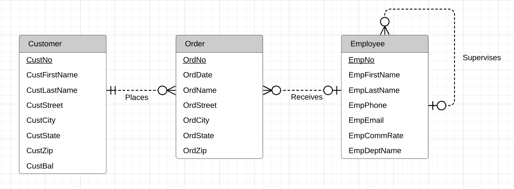

### Problem 4

Extend the ERD from problem 3 with the Product entity type and an M-N relationship between Product and Order. Choose an appropriate relationship name using your common knowledge of connections between products and orders. Define minimum cardinalities so that an order is optional to a product, and a product is mandatory to an order. For the Product entity type, add attributes ProdNo (primary key), ProdName, ProdQOH, ProdPrice, and ProdNextShipDate. For the M-N relationship, add an attribute for the order quantity. If you are using a data modeling tool that supports data type specification, choose appropriate data types for the attributes based on your common knowledge.

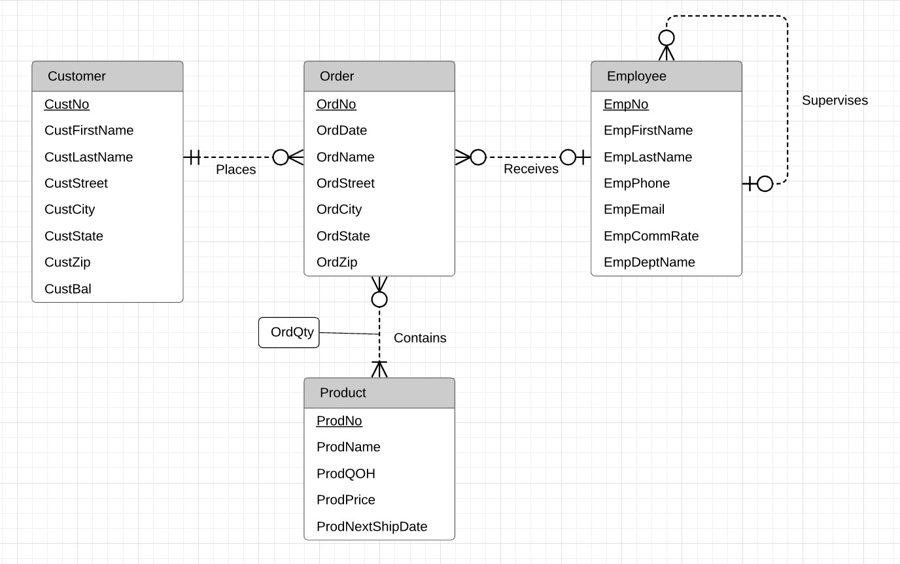

### Problem 5

Revise the ERD from problem 4 by transforming the M-N relationship into an associative entity type and two identifying, 1-M relationships.

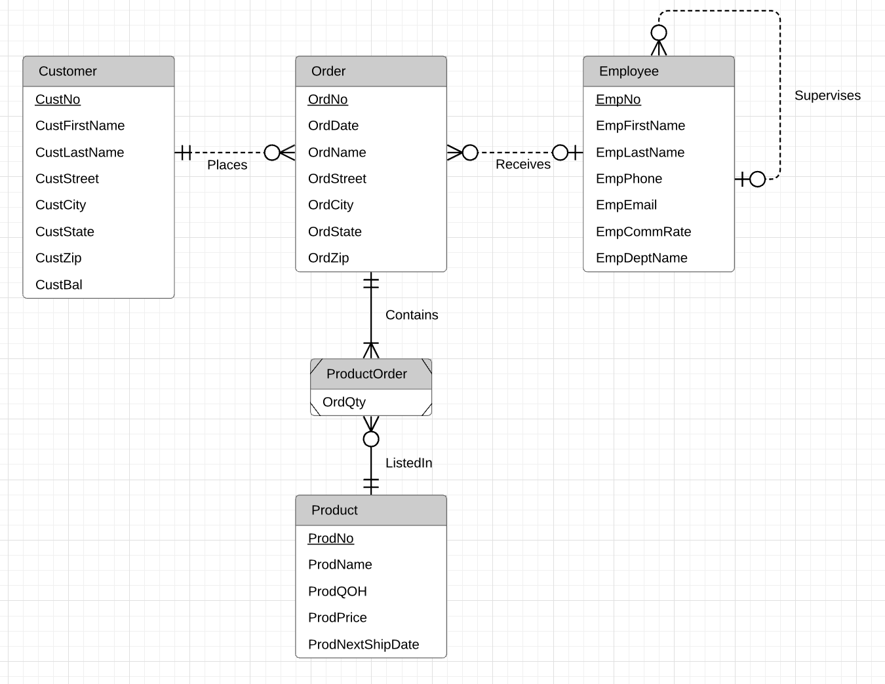

### Problem 6

Using your ERD from problem 5, add violations of consistency rules for identification dependency (weak entity type rule, identifying relationship rule, and identification dependency cardinality rule) and redundant foreign keys (1 rule).

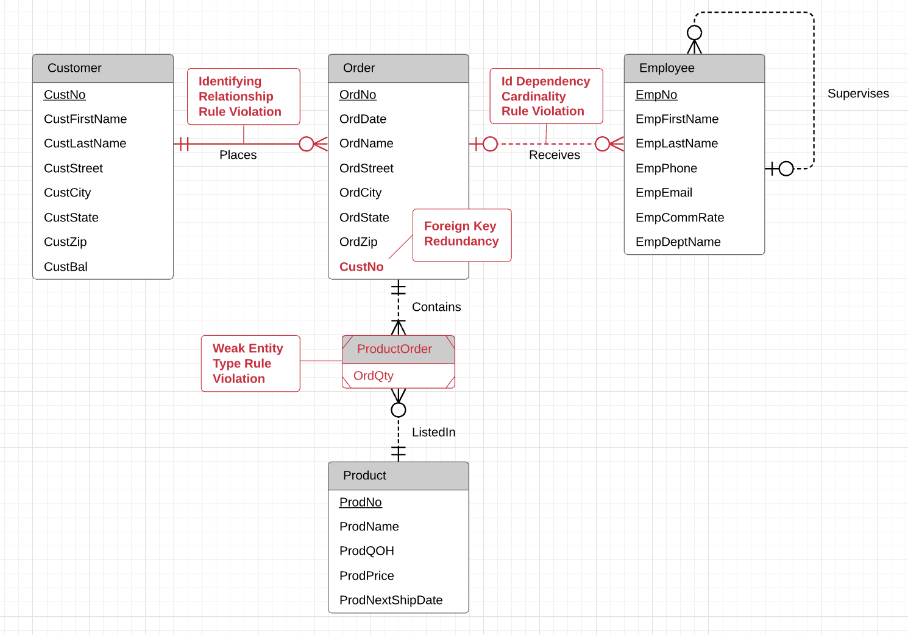

### Problem 7

For each diagram error in Figure P7, identify the diagram rule violated and suggest possible resolutions of the error. The ERD has generic names so that you will concentrate on finding diagram errors rather than focusing on the meaning of the diagram.

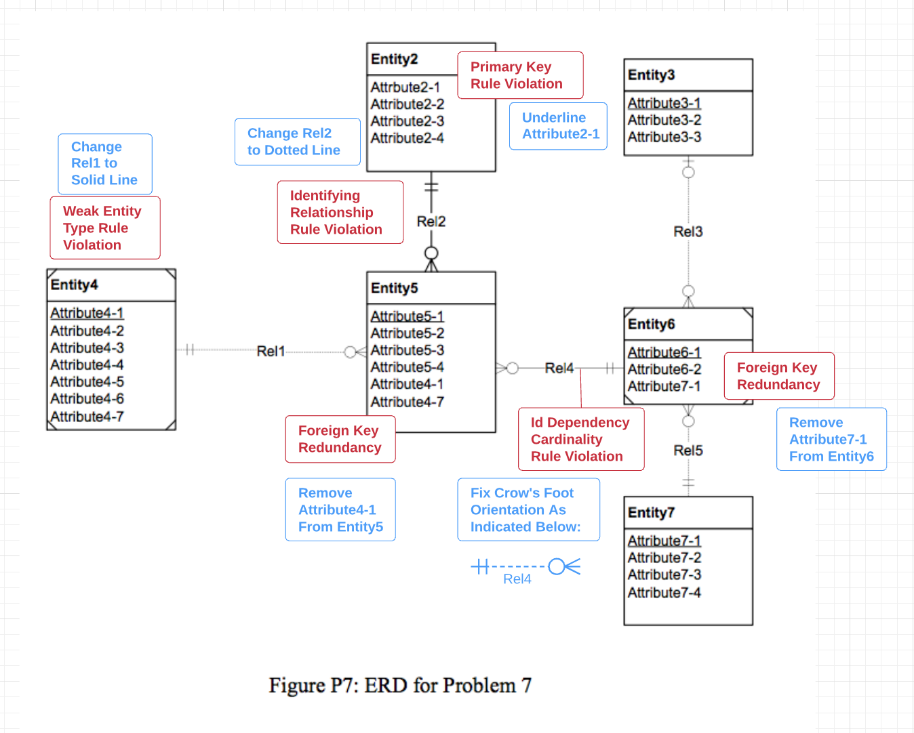

## Graded Assignment

### Problem 1

Create an ERD containing the TestOrder and Specimen entity types and a 1-M relationship from Specimen to TestOrder. For each specimen collected, the database should record a unique SpecNo, SpecArea (vaginal, cervical, or endocervical), and SpecCollMethod (thin prep or sure path). A test order contains a TONo (primary key), TOTestName, TOTestType (HPV, CT/GC, CT, or GC), and TOTestResult (positive, negative, equivocal, or failure).  A specimen does not have a test order until a delay, from hours to days. If a test order produces a failure, the specimen is given a new test order and tested again until a non-failure result is obtained. A test order is created for exactly one specimen.

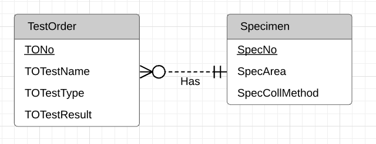

### Problem 2

Augment your ERD from problem 1 with the Supply entity type and an M-N relationship between TestOrder and Supply. Choose a name for the relationship based on your common knowledge of test orders and supplies. A test order can use a collection of supplies (0 or more) and a supply can be used on a collection of test orders (0 or more). The Supply entity type contains SuppNo (primary key), SuppName, SuppLotNo, and SuppQOH.

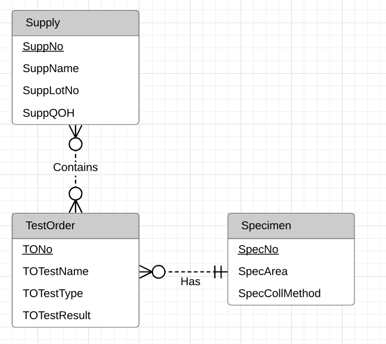

### Problem 3

Use the M-N equivalence rule to transform the M-N relationship in Problem 2. You should choose appropriate names for the new relationships and entity type.

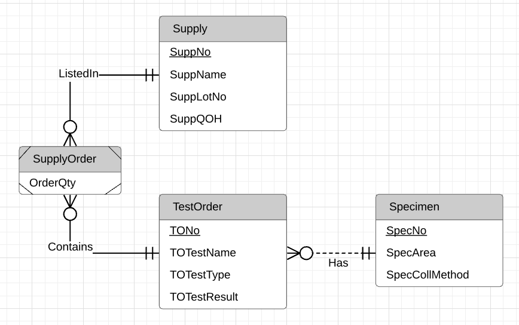

### Problem 4

For each consistency error in Figure 1, you should identify the consistency rule violated and suggest possible resolutions of the error. The ERD has generic names to help will concentrate on finding diagram errors rather than focusing on the meaning of the diagram.

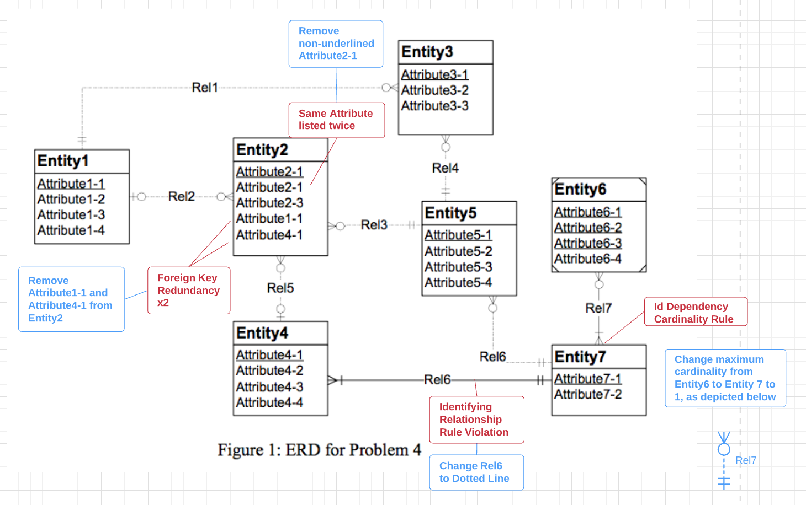
